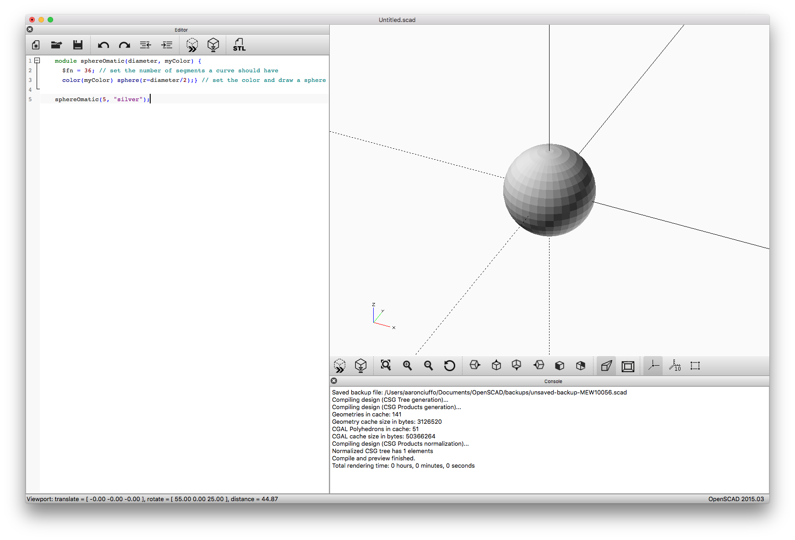
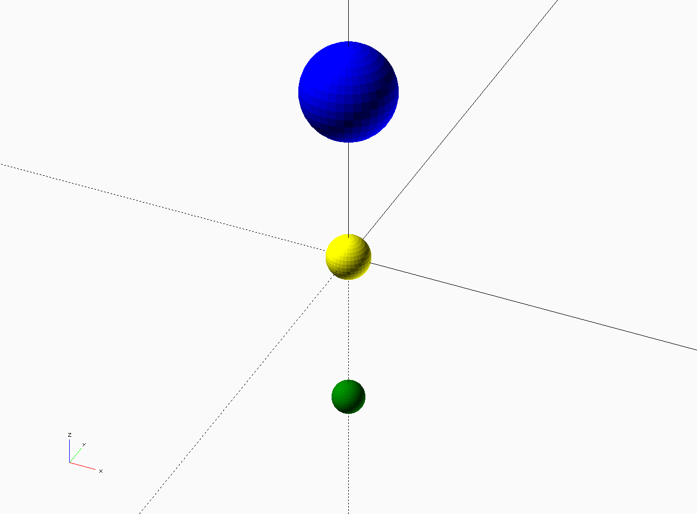
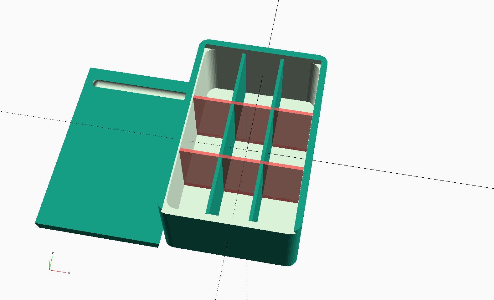

# Writing Your Own Module
Remember way back to the customizer lessons? Probably not. I'll wait here while you go back and look at the part where I told you to play with the compartments. You'll probably notice something strange about the yCompartment variable.

Don't worry, I've got a cup of coffee. I can wait.

You probably noticed that you can adjust the xCompartment values, but that the yCompartment variable doesn't do antyhing at all.  This is because the yCompartment module isn't finished. I left it for you to try writing!

A few notes about modules before you jump in:
* Modules can receive variables by putting variables into the parentheses. When the module is called it will expect a value to be 'passed' to it. In this case the (mostly useless) module 'sphereOmatic' expects to get the variable diameter. It will draw a colored sphere when called.

Example 1:
```
    module sphereOmatic(diameter, myColor) {
      $fn = 36; // set the number of segments a curve should have
      color(myColor) sphere(r=diameter/2);} // set the color and draw a sphere
    }
```



Every time sphereOmatic is called, a new value for diameter and color can be sent.  Try out the example below.

Example 2:
```
    module SphereOmatic(diameter, myColor) {
      $fn = 36; color(myColor) sphere(r=diameter/2);
    }

    sphereOmatic(5, "yellow");
    translate([0, 0, 20]) sphereOmatic(10, "blue");
    translate([0, 0, -20]) sphereOmatic(4, "green");

```



  1. Try the code out above. Change the sphere sizes and colors.
  2. Add a sphere to the left and right of the yellow sphere with the diameter 5 and the color silver and black.
  
Each time you call out the name of the module you send along with it a new diameter and a new color. These values are stuck inside the module. They are stored inside variables that are only available to sphereOmatic.  No other part of the script is aware of the variable called 'color'.  We say that the 'scope' of myColor is local to sphereOmatic. Variables like boxX and boxY are called 'global variables.' Any part of the OpenSCAD script can see them. They don't need to be passed around. We say the scope of these variables is global. This is a big topic that can take up an entire month in a Computer Science course. Don't panic if you don't get it yet. I just wanted to introduce you to the concept.
    
What you need to know is this: If you run a module from within another module you need to send any information along that it needs to know. In this case the yDividers module needs to know how big the innner box is so it can make the divders the right size.

The next section is really challenging and will probably take some trial-and-error to figure out exactly what you need to do. This would be a good opportunity to get some fresh air and a drink of water before continuing.

 If you cannot solve this problem, *don't worry*, you can continue on with the rest of the lessons and come back to this later.

  3. Start out with a fresh version of the code and find the module `dividedBox()`
  4. Find where `yDividers()` is called; make sure you pass the size of the innerBox to it.
    - Hint: look at how `xDividers()` is called just above
  5. Find the module `xDividers()` and take a look at what it does.
  6. Copy and paste the contents of the xDividers module into the yDividers module.  **DOUBLE CHECK** the opening and closing curly brackets. If you end up with too many your script will not run.
  7. You will need to change a few things to make the code work properly.
    - Hint 1: you are working with the **y**Dividers now. Make sure you are working with the y dimensions everywhere inside this module.
    - Hint 2: you will need to adjust the `cube()` statement so the divider is drawn correctly  
    - Hint 3: The red highlighted parts of your drawing are the part you are working on



#### Questions:
* Why could you adjust the columns, but not adjust the number of rows at first?
* Why did you need to include the variable innerBox when you called `yDividers()`?
* Why do you think there is an `if` statement inside the module?
* What do you think the `for` statement does? 
    * Try to explain this to someone else.
* Try to explain what scope means to someone.

[<< Lesson 4 - Working With Modules](./Lesson4_Modules.scad) | 
