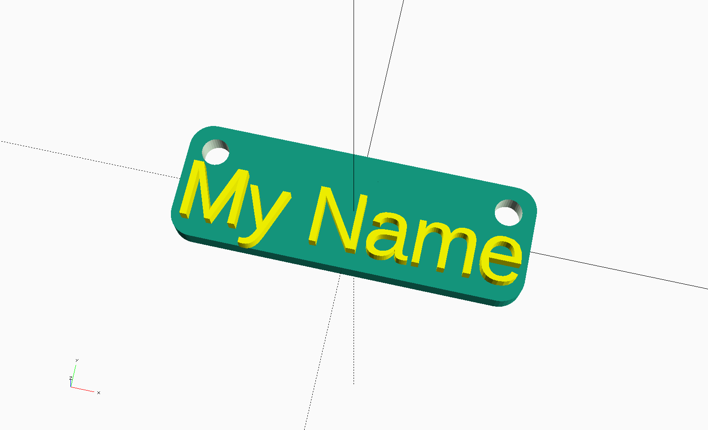

# Begin your own Customizable Project
You have enough experience now to begin creating your own customizable project. Along the way we will learn about the Thingiverse customizer and adding your own customized projects. Part of each section will include some sample code and a problem to solve.

You will be creating a customizable name plate like the one shown here.



## Comment Blocks:
When OpenSCAD sees this `//` it ignores everything from the last slash to the end of the line. This is handy for leaving notes to yourself or others. Sometimes comments need to extend over multiple lines. When OpenSCAD sees `/* */ ` everything between the stars is ignored. This is called a 'comment block.' Comment blocks can be one or many lines long:
```
//This is a one-line comment
//This is an unnecessarily long single line comment that runs on way too long and really should be split into multiple lines to make it easier to read. The dinner order for tonight is: spam; ham; spam and ham; ham and eggs; spam, spam, spam with a side of spam and ham. 
//the comment above would read beter as a comment block:
/*
This is an unnecessarily long single line comment that runs on way too long and 
really should be split into multiple lines to make it easier to read. 
The dinner order for tonight is: 
   * spam; 
   * ham; 
   * spam and ham; 
   * ham and eggs; 
   * spam, spam, spam with a side of spam and ham. 
*/
```

[Thingiverse Customizer:](http://customizer.makerbot.com/docs)
The customizer uses special comment blocks to help the customizer do its magic.

  1. Open a new OpenSCAD project and create header like the one below. This is a Tab header for the customizer.
```
     /* [Base] */
```
  2. Look at the example image and think about the variables and values you will need to create the base. What variables should your users be able to adjust? Add some well named variables below that will set the X, Y and Z size of the base.
  3. Create a module for drawing a base and call the module. Make sure this compiles.
```

    module base() {
    }

    base();
```
  4. Add instructions to the base module to draw a rectangular base using the variables you created earlier. If you used different variables, feel free to use them.


```
    module base() {
      cube([xSize, ySize, zSize], center = true)
    }

    base();
```
  5. Challenge: Use a `roundedBox()` instead of a `cube()` for the base. You will need to import `MCAD/boxes.scad`.  Learn more at the [OpenSCAD wiki](https://en.wikibooks.org/wiki/OpenSCAD_User_Manual/Libraries).

## Questions:
* What other variables do you think you will need in creating this project?
* Make a list of the variables you think you will need.
* Make a list of the modules you think you will need as you complete this project.

[<< Lesson 5 - Writing Your Own Module](./Lesson5_Writing_Module.md) | [Lesson 7 - Add Mounting Holes >>](./Lesson7_Mounting_Holes.md)
