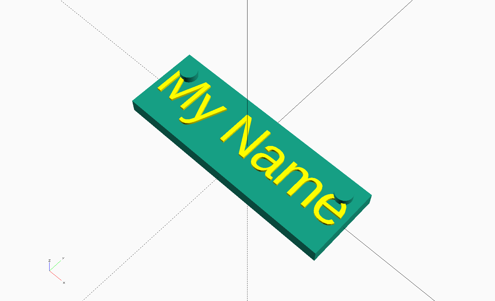

# Joining it All Together

## Objectives:
* Practice calling one module from another
* Practice using `union()`

Right now we have three separate parts that look like they are joined together. In some cases, this can be exported as an STL and it will indeed print properly on a 3d Printer. The text is not correctly placed however. Also, if we've made any errors in our placement of objects we may end up with something that *looks* printable, but that is actually impossible to print.

We can solve this by joining everything together using OpenSCAD's `union()` and `difference()` modules. These are in the class of [boolean](https://en.wikibooks.org/wiki/OpenSCAD_User_Manual/The_OpenSCAD_Language#Chapter_5_--_Boolean_combination) opperations and could be a whole set of lessons in themselves.

  1. Create a module that contains all the separate modules we need to make the name plate. Call the module `makeTag()`
  2. Check that everything looks like the sample image. Notice that the holes are filled in and that the text is too low on the name plate. We will fix that now!
  


  3. In the module we need to `union()` the text and the base. The text needs to be raised up so it appears the proper height over the base. Start with the code below and try to figure out how to raise the text so it is EXACTLY the height of base from the origin. Also try to move the text so it doesn't run into the holes.
```
      module makeTag() {
        union() {
          base();
          translate([0, 0, 0]) textExtrude();
        }
        #holes() // turn on debug highlighthing to make this easier to see
      }
```

[<< Lesson 8 - Add Extruded Text](./Lesson8_Add_Text.md) | [Lesson 10 - Removing The Unwanted Bits >>](./Lesson10_Remove_Bits.md)
