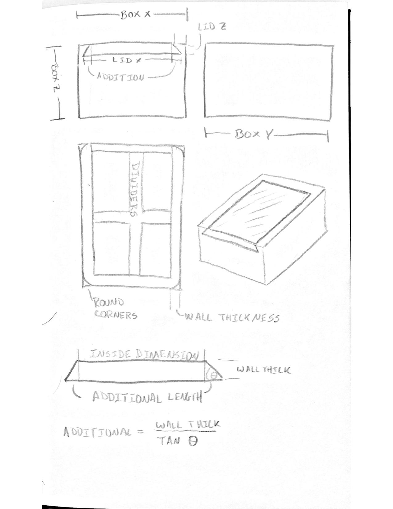
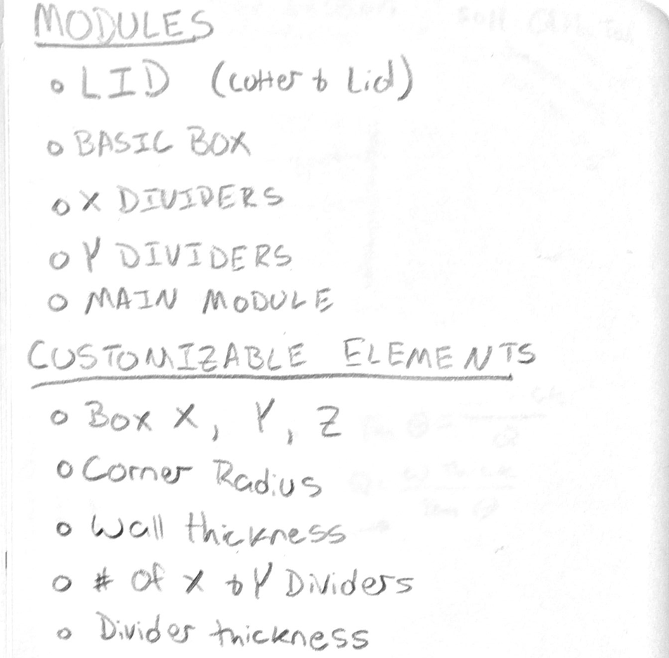

# Designing a 3D Printable Box in OpenSCAD
## Summary
This is a set of lessons that walks through designing and creating a customizable 3D Printed Box using OpenSCAD. The attached lessons will introduce you to parametric design and help you build your own customizable box.

****This can also be viewed and customized on the [Thingiverse](https://www.thingiverse.com/thing:1201466). The Markdown on Thingiverse is broken so the documentation is replicated here.****

**Please Note:** Some features have been left incomplete as an exercise for the reader.  For a complete version please see the [original box with sliding lid](http://www.thingiverse.com/thing:201304)

## Table Of Contents
* [Identify a Problem](#IDProblem)
* [Define a Solution](#DefineSolution)
* [Design Cycle](#DesignCycle)
* [Lesson 0 - Introduction](./Lesson0_introduction.md)
* [Lesson 1 - Thingiverse Customizer](./Lesson1_Customizer.md)
* [Lesson 2 - Customizing in OpenSCAD](./Lesson2_OpenSCAD.md)
* [Lesson 3 - Variables](Lesson3_Variables.md)
* [Lesson 4 - Working with modules](./Lesson4_Modules.scad)
* 

## Identify A Problem
Medication in pill form is difficult to pack in small quantities. Pill bottles are large and cumbersome and do not fit in pockets or small purses. Blister packs rupture leaving the medication exposed to  contamination and abrasion.

## Define a Solution
A small, refillable pill box with a secure lid that holds one or two doses would be ideal for transporting medication in a pocket or purse.

### Define Specifications
The final design must:
* fit in an average pocket or small purse
* have a secure lid
* hold one or two doses of medication
* protect the medication from contamination and abrasion

### Research Options and Propose Solutions
The following ideas were researched on Thingiverse for inspiration. 
* [Bottle with screw on lid](https://www.thingiverse.com/search?q=pill+bottle&type=things&sort=relevant)
* [Box with snap on lid](https://www.thingiverse.com/search?q=snap+lid&type=things&sort=relevant)
* [Box with slide lid](https://www.thingiverse.com/search?q=slide+lid&type=things&sort=relevant)
* [Box with iris lid](https://www.thingiverse.com/search?q=iris&type=things&sort=relevant)

### Select a Solution and Develop
*Box with sliding lid*
* lid should be secure, but not too difficult to open to keep out contaminants 
* box should be sturdy to hold up to pocket/purse wear and tear
* closure should be robust and not too complex
* box should protect medication from abrasion

## Design Cycle
### Design Prototype 1
Make rough outline of OpenSCAD project on paper defining variables and modules; this is sometimes called *psuedo code*.

### Design Prototype 2
Develop a 3D model in OpenSCAD using the plan and drawings.

### Design Prototype 3
3D print several models and make changes to the design as needed:
* Lid fit too snug; increase lid slot
* Add multiple dividers to keep pills from touching; they abrade less this way

### Evaluate finial product
Advantages:
* Holds two doses of medicine
* Lid is very secure

Disadvantages:
* Box is defined by external dimensions rather than by the size of the medication
* Lid is a bit too secure, difficult to open
* Lid is not very attractive

### Restart design cycle
Identify problems and propose solutions.
